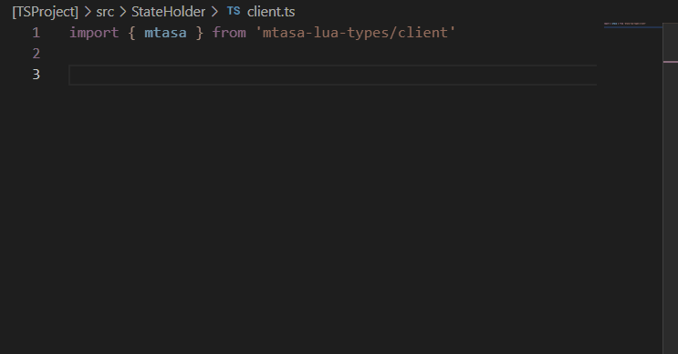
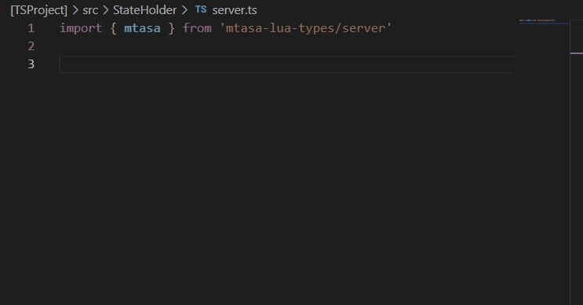
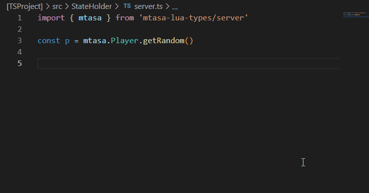
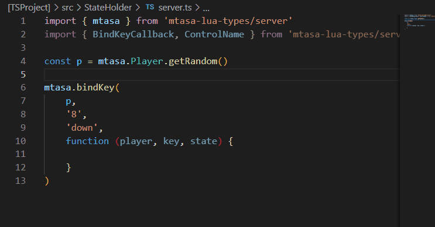

# 🎩 TypeScript type definitions for MTASA Lua

Declares TypeScripts types for MTASA. They are generated and updated with
[wiki-parser](https://github.com/mtasa-typescript/mtasa-wiki-parser).

# 🎈 How to use

## 💎 You are MTASA Resource developer

⚠ If you are resource developer, you should not manually install this package.
There is a [template](https://github.com/mtasa-typescript/resource-boilerplate)
you can use for creating MTASA Resources on TypeScript.

## ⚒ Another way

If you would like to use the types outside of the resource,
you can add them into your project manually

```shell
npm install --save-dev mtasa-lua-types
```

# 🌟 Features

Examples of type definition features

## ▶ Global Functions

```ts
import { mtasa } from 'mtasa-lua-types/client'

mtasa.outputChatBox(
    `Your health: ${mtasa.getElementHealth(
        mtasa.localPlayer
    )}`
)
```



## ▶ OOP

```ts
import { mtasa } from 'mtasa-lua-types/server'

const v = new mtasa.Vehicle(411, 10, 11, 12)
mtasa.Player
    .getRandom()
    .warpIntoVehicle(v, 1)
```



## ▶ Defined callbacks

```ts
import { mtasa } from 'mtasa-lua-types/server'

const p = mtasa.Player.getRandom()

mtasa.bindKey(
    p,
    '8',
    'down',
    function (player, key, state) {

    }
)
```



## ▶ Generics

```ts
import { mtasa } from 'mtasa-lua-types/server'
import { BindKeyCallback } from 'mtasa-lua-types/server/structure'

const p = mtasa.Player.getRandom()
type CallbackFunctionType =
    BindKeyCallback<[number, string]>;

mtasa.bindKey<CallbackFunctionType>(
    p,
    '8',
    'down',
    function (player, key, state, num, str) {
        mtasa.iprint(player, key, state, num, str)
    },
    5, 'string'
)
```



# 🛠 How to contribute

If you found incorrect definitions or would like to suggest an idea, you can
[create an issue](https://github.com/mtasa-typescript/mtasa-lua-types/issues).

If you would like to create a merge request, see the content below.

## 🎇 Functions

If you would like to add or edit function. You should not edit code in this repository.
A large part of function definitions are being automatically generated via mtasa-wiki-parser.

See the mtasa-wiki-parser ["How to contribute" documentation](https://github.com/mtasa-typescript/mtasa-wiki-parser/tree/develop#-how-to-contribute)
for more details.

### ❗ `utf8` functions

Due to [this issue](https://github.com/mtasa-typescript/mtasa-wiki-parser/issues/31) `utf8`
functions are unprocessed by the mtasa-wiki-parser.

All utf8 function definitions can be changed manually.

## 🕶 OOP Methods, Fields, Classes

All OOP declarations are being automatically generated via mtasa-wiki parser.

See the mtasa-wiki-parser ["How to contribute" documentation](https://github.com/mtasa-typescript/mtasa-wiki-parser#connect-dump-repository)
for more details.

## 🔁 Code requirements

- Be sure to run tests before creating a merge request.
- Create an issue before doing the merge request, if it is possible.


